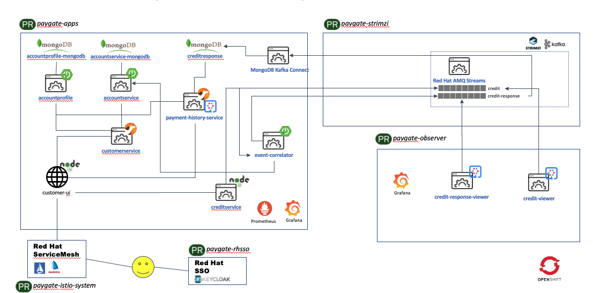

# Payment Gateway Demo

## Overview
This project using the concept of Payment Gateway to demonstrate some of the key features of Red Hat products. 

The following diagram shows the demo environment created once it is installed on OpenShift.



This an on-going demo. It will be enhanced over time and new products will be introduced over time where new use cases are being introduced.

### Explanation of Each Components in The Demo

All the following components are deployed automatically and configured properly to allow demo can be without any additional manual configurations. Please refer to the installation section for more details.

As the demo grows over time, the number of microservices also increased. This sections outlines the functionality and roles of each of this component.

* **CustomerUI**
<br>CustomerUI is developed in NodeJs framework. It provides the UI to demo credit transfer from one account to the other account. There are 2 demo accounts created by the demo installation script:
<br><br>
&nbsp;&nbsp;&nbsp;&nbsp;&nbsp;&nbsp;&nbsp;&nbsp;&nbsp;&nbsp;&nbsp;__Name__: John Doe<br>
&nbsp;&nbsp;&nbsp;&nbsp;&nbsp;&nbsp;&nbsp;&nbsp;&nbsp;&nbsp;&nbsp;**Username**: john<br>
&nbsp;&nbsp;&nbsp;&nbsp;&nbsp;&nbsp;&nbsp;&nbsp;&nbsp;&nbsp;&nbsp;**Password**: password<br>
&nbsp;&nbsp;&nbsp;&nbsp;&nbsp;&nbsp;&nbsp;&nbsp;&nbsp;&nbsp;&nbsp;**Account Id**: 20191029-MY-123456789
<br><br>
&nbsp;&nbsp;&nbsp;&nbsp;&nbsp;&nbsp;&nbsp;&nbsp;&nbsp;&nbsp;&nbsp;**Name**: Jenny Doe<br>
&nbsp;&nbsp;&nbsp;&nbsp;&nbsp;&nbsp;&nbsp;&nbsp;&nbsp;&nbsp;&nbsp;**Username**: jenny<br>
&nbsp;&nbsp;&nbsp;&nbsp;&nbsp;&nbsp;&nbsp;&nbsp;&nbsp;&nbsp;&nbsp;**Password**: password<br>
&nbsp;&nbsp;&nbsp;&nbsp;&nbsp;&nbsp;&nbsp;&nbsp;&nbsp;&nbsp;&nbsp;**Account Id**: 20191029-MY-123456710
<br><br>
The CustomerUI service is deployed with name as **customer-ui** on OpenShift. It is protected with Red Hat Single Sign-On (RHSSO). The respective user credentials above are created in RHSSO when the installation script is executed. Please refer the section of RHSSO for more details on this.
<br><br>
* **Customer Service**
<br>Customer Service is developed in Red Hat Fuse. This service provide CustomerUI a single API for CRUD operations whichever applicable. At the current demo, it is only provides GET operation to retrieve account profile and account balance information. It provides a single API call to retrieve customer account profile and account balance from Account Profile Service and Account Service, and merges these data from 2 separate locations and return the information in one single JSON format.
<br><br>
The Customer Service is deployed with name as **customerservice** on OpenShift. It serves the REST at paths
<br>

&nbsp;&nbsp;&nbsp;&nbsp;&nbsp;&nbsp;&nbsp;&nbsp;&nbsp;&nbsp;&nbsp;**GET** `/ws/pg/customer/{accountId}`
<br>

&nbsp;&nbsp;&nbsp;&nbsp;&nbsp;&nbsp;&nbsp;&nbsp;&nbsp;&nbsp;&nbsp;**GET** `/ws/pg/customer/all`
<br><br>The following shows the Camel context diagram of the Fuse implementation.


<br><br>
* **Account Service**
<br>Account Service provides REST interface to access and retrieve the latest account balance information from the Account Balance DB (MongoDB). The database starts with balance of $250 for John Doe and $150 for Jenny Doe.
<br><br>It is developed in SpringBoot, and deployed as **accountservice** on OpenShift. It serves the REST requests at the following paths:
<br>

&nbsp;&nbsp;&nbsp;&nbsp;&nbsp;&nbsp;&nbsp;&nbsp;&nbsp;&nbsp;&nbsp;**GET** `/ws/pg/balance/{accountId}`
<br>

&nbsp;&nbsp;&nbsp;&nbsp;&nbsp;&nbsp;&nbsp;&nbsp;&nbsp;&nbsp;&nbsp;**GET** `/ws/pg/balance/all`
<br>

&nbsp;&nbsp;&nbsp;&nbsp;&nbsp;&nbsp;&nbsp;&nbsp;&nbsp;&nbsp;&nbsp;**POST** `/ws/pg/balance/`
<br>

&nbsp;&nbsp;&nbsp;&nbsp;&nbsp;&nbsp;&nbsp;&nbsp;&nbsp;&nbsp;&nbsp;**PUT** `/ws/pg/balance/`
<br><br>

* **Account Profile Service**
<br>Account Profile Service provides REST interface access to customer account profile information. It retrives customer account profile stored in the Account Profile DB (MongoDB).
<br><br>It is developed in SpringBoot and deployed as **accountprofile** on OpenShift. It provides the following REST interfaces:
<br>

&nbsp;&nbsp;&nbsp;&nbsp;&nbsp;&nbsp;&nbsp;&nbsp;&nbsp;&nbsp;&nbsp;**GET** `/ws/pg/account/{accountId}`
<br>

&nbsp;&nbsp;&nbsp;&nbsp;&nbsp;&nbsp;&nbsp;&nbsp;&nbsp;&nbsp;&nbsp;**GET** `/ws/pg/account/all`
<br>

&nbsp;&nbsp;&nbsp;&nbsp;&nbsp;&nbsp;&nbsp;&nbsp;&nbsp;&nbsp;&nbsp;**POST** `/ws/pg/account`
<br><br>

* **Credit Service**
<br>Credit Service is developed in NodeJs and provides REST API for CustomerUI to perform credit transfer. Upon receiving of credit transfer request, it creates the respective data entry in `credit` Kafka topic in AMQ Streams. 
<br><br>It is deployed as **creditservice** on OpenShift. It provides the following REST interface:
<br>

&nbsp;&nbsp;&nbsp;&nbsp;&nbsp;&nbsp;&nbsp;&nbsp;&nbsp;&nbsp;&nbsp;**POST** `ws/pg/credits`
<br><br>

* **AMQ Streams**
<br>AMQ Streams is Red Hat commercial version of Apache Kafka based on Strimzi. It provides an agile and high performance event messaging platform on OpenShift. In this demo, there will be 2 Kafka topics created to demonstrate the credit transfer events and the correlation of credit account balance.
<br>

&nbsp;&nbsp;&nbsp;&nbsp;`credit` Kafka topic keeps the credit event data sent by the **Credit Service**. It will be consumed by **Event Correlator**.
<br>

&nbsp;&nbsp;&nbsp;&nbsp;`creidt-response` Kafka topic keeps the correlated / credit transfer history. This event data is sent by the **Event Correlator** once the credit balance for each source account and target account is updated. This will be picked up later by **MongoDB Kafka Connect**.
<br><br>

* **Event Correlator**
<br>**Event Correlator** is a microservice developed in SpringBoot. It listens to the new credit event data in `credit` Kafka topic and perform the necessary account balance update to the source account and target account by calling the **Account Service** REST API.
<br>Once the account balance is updated in the the respective accounts. It will create an event entry in `credit-response` Kafka topic containing the detail of the transction history.
<br><br>

* **MongoDB Kafka Connect**
<br>This is a MongoDB Kafka Connect that listen to the new event data entry in `credit-response` Kafka topic and create an transaction history entry in the **Credit Response DB** (MongoDB).
<br><br>

* **RHSSO**
<br>Red Hat Single Sign-On (RHSSO) is a lighweight and feature rich SSO solution based on Keycloak. It provides easy and quick approach to protect and enable web applications and microservices with many industry security standards. Freeing the developers from these challenges tasks to fully focus on developing the application logic.  
<br>A PaymentGateway security realm is created by the installation script with the following details:<br><br>


<br><br>

## How to Install The Demo

### Pre-Requisitions

* You will need to have jq command line install on your PC. Please proceed to download and install from https://stedolan.github.io/jq/
* You should have Red Hat AMQ Streams Operator installed by your cluser-admin. For simplicity, install the operator for all namespaces.
* You need to have access to Red Hat website to download [AMQ Streams OpenShift Installation and Example Files](https://access.redhat.com/jbossnetwork/restricted/listSoftware.html?downloadType=distributions&product=jboss.amq.streams)
* You need to have already logon to OpenShift with a user. Non-admin user is fine.

### Installation Steps

1. Clone this repo into your local PC.

2. Download the Red Hat [AMQ Streams OpenShift Installation and Example Files](https://access.redhat.com/jbossnetwork/restricted/listSoftware.html?downloadType=distributions&product=jboss.amq.streams). Unzip the downloaded files and copy the contents to the repo directory `kafka-resources`. It should be ended with 2 folders under this directory named `examples` and `install`. 

3. Edit `kafka-resources/examples/kafka/kafka-persistent.yaml` with the following changes. 
<br><br>Change the following with the kafka-cluster name that you prefer. 

```
metadata:
  name: kafka-cluster
```
Add the following at the end of the `kafka-persistent.yaml` file and change the `watchedNamespace` with the OpenShift project name and suffix the value with your OpenShift username (you can retrieve this with `oc whoami` command). In this example my username is `chgan`, OpenShift project name is `pg-gw`, so the value for `watchedNamespace` will be `chgan-pg-gw`
```
entityOperator:
    topicOperator:
      watchedNamespace: chgan-pg-gw
      reconciliationIntervalSeconds: 90
      zookeeperSessionTimeoutSeconds: 20
      topicMetadataMaxAttempts: 6
      image: registry.redhat.io/amq7/amq-streams-operator:1.3.0
```
Some order version of the yaml file comes with the `entityOperator` stanza. So you may just modify the existing stanza according to the above example. This is also one of the reason I do not automate this part of yaml file changes in the demo installation script.

The following illustrate the complete `kafka-persistent.yaml`. You may also change storage size to smaller figure since this is just a demo.

```
apiVersion: kafka.strimzi.io/v1beta1
kind: Kafka
metadata:
  name: kafka-cluster
spec:
  kafka:
    version: 2.4.0
    replicas: 3
    listeners:
      plain: {}
      tls: {}
    config:
      offsets.topic.replication.factor: 3
      transaction.state.log.replication.factor: 3
      transaction.state.log.min.isr: 2
      log.message.format.version: "2.4"
    storage:
      type: jbod
      volumes:
      - id: 0
        type: persistent-claim
        size: 10Gi
        deleteClaim: false
  zookeeper:
    replicas: 3
    storage:
      type: persistent-claim
      size: 10Gi
      deleteClaim: false
  entityOperator:
    topicOperator:
      watchedNamespace: chgan-pg-gw
      reconciliationIntervalSeconds: 90
      zookeeperSessionTimeoutSeconds: 20
      topicMetadataMaxAttempts: 6
      image: registry.redhat.io/amq7/amq-streams-operator:1.3.0
```

4. Edit the `kafka-resources/examples/kafka-connect/kafka-connect.yaml` with the following example. 
<br><br>Change `metadata->name` to `mongodb-connect-cluster`.
<br><br>Notice that the `bootstrapServers: kafka-cluster-kafka-bootstrap:9093` and `secretName: kafka-cluster-cluster-ca-cert`
<br>From the earlier example, the Kafka Cluster name is `kafka-cluster`, so our `bootstrapServers` and `secretName` will be prefixed with `kafka-cluster`
<br><br>Make sure you are using this value: `image: docker.io/chengkuan/amq-streams-kafka-connect-23:1.3.0`. This is the MongoDB Kafka Connect docker image that I had created for this demo.

```
apiVersion: kafka.strimzi.io/v1beta1
kind: KafkaConnect
metadata:
  name: mongodb-connect-cluster
#  annotations:
#  # use-connector-resources configures this KafkaConnect
#  # to use KafkaConnector resources to avoid
#  # needing to call the Connect REST API directly
#    strimzi.io/use-connector-resources: "true"
spec:
  version: 2.4.0
  replicas: 1
  bootstrapServers: kafka-cluster-kafka-bootstrap:9093
  tls:
    trustedCertificates:
      - secretName: kafka-cluster-cluster-ca-cert
        certificate: ca.crt
  image: docker.io/chengkuan/amq-streams-kafka-connect-23:1.3.0
```

5. Finally, at the command prompt. Make sure you login to OpenShift with the correct user and run the following to deploy the demo.
```
cd bin 
./deployDemo.sh`
```
## Additional Information

* You may want to refer to this [article](http://braindose.blog/2020/03/11/event-based-microservices-kafka-openshift/) that I had created sometime ago on how to implement most of the component that I showcase in this demo. Thought the codes on this article may be outdated but it does provide detail explaination on how to create some of the key components.