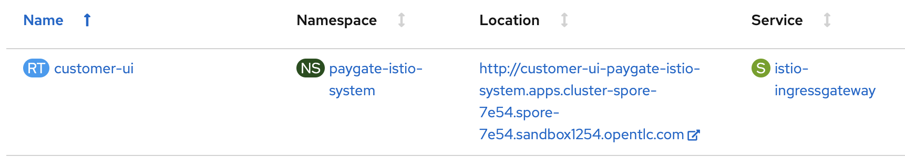
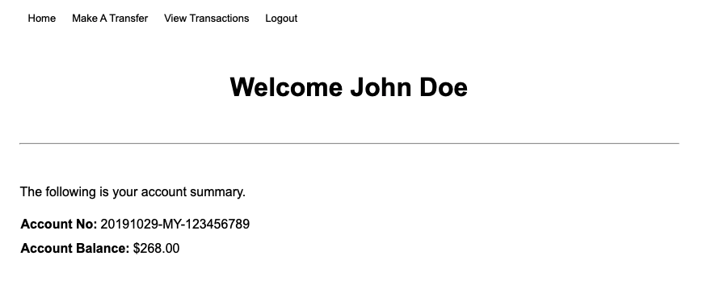
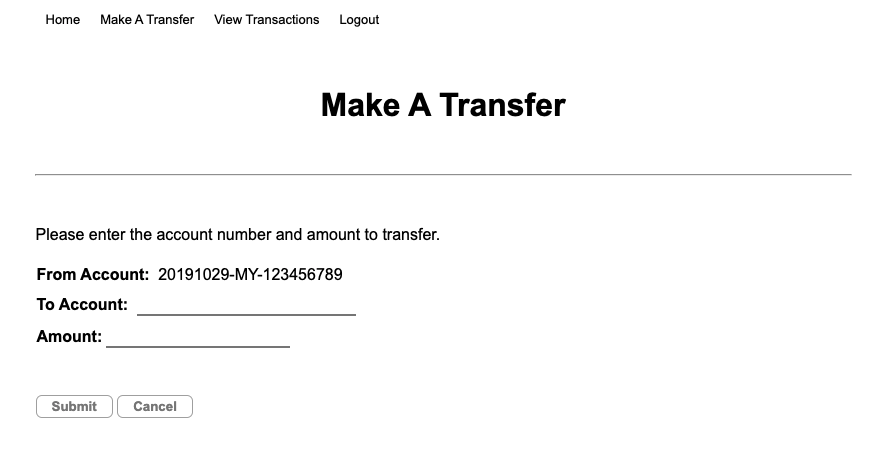

# Payment Gateway Demo

## Overview
This project is using the Payment Gateway use case to demonstrate some of the key features of Red Hat products. This an on-going project and will be enhanced over time to add more use cases.
<br><br>
The following diagram shows the demo environment created once it is installed on OpenShift.


<br>

### Quick View of Major Changes

Note: The lowest in the list is the latest change.

* Added Promethues and Grafana monitoring.
* Simplified installation steps.
* Enable Red Hat ServiceMesh, an Istio based solution.

### Product Vesions
These are product version when this demo is developed. However it should work on other versions provided the products required are supported / can be technically deployed on the OpenShift version.

* OpenShift Container Platform 4.*
* Prometheus Operator Community 0.32.0
* Red Hat AMQ Streams Operator 1.4.1
* Red Hat ServiceMesh Operator 1.0.2
* Kiali Operator 1.0.7 by Red Hat
* Jaeger Operator 1.13.1 by Red Hat
* ElasticeSearch Operator 4.2.4-201911050122 by Red Hat


### Components in The Demo

All the following components are deployed automatically and configured to allow demo can be done without any additional manual configurations. Please refer to the installation section for more details.

The number of microservices and components will be increased over the time when new features or use cases are introduced. This sections serves the purpose of providing high level documentation on each of these components.

* **CustomerUI**
<br>CustomerUI is implemented in NodeJs framework. It provides the UI to demo credit transfer from one account to the other account. There are currently 2 demo accounts created by the demo installation script as per the following:
<br>

&nbsp;&nbsp;&nbsp;&nbsp;&nbsp;&nbsp;&nbsp;&nbsp;&nbsp;&nbsp;&nbsp;**Name**: John Doe<br>
&nbsp;&nbsp;&nbsp;&nbsp;&nbsp;&nbsp;&nbsp;&nbsp;&nbsp;&nbsp;&nbsp;**Username**: john<br>
&nbsp;&nbsp;&nbsp;&nbsp;&nbsp;&nbsp;&nbsp;&nbsp;&nbsp;&nbsp;&nbsp;**Password**: password<br>
&nbsp;&nbsp;&nbsp;&nbsp;&nbsp;&nbsp;&nbsp;&nbsp;&nbsp;&nbsp;&nbsp;**Account Id**: 20191029-MY-123456789
<br>

&nbsp;&nbsp;&nbsp;&nbsp;&nbsp;&nbsp;&nbsp;&nbsp;&nbsp;&nbsp;&nbsp;**Name**: Jenny Doe<br>
&nbsp;&nbsp;&nbsp;&nbsp;&nbsp;&nbsp;&nbsp;&nbsp;&nbsp;&nbsp;&nbsp;**Username**: jenny<br>
&nbsp;&nbsp;&nbsp;&nbsp;&nbsp;&nbsp;&nbsp;&nbsp;&nbsp;&nbsp;&nbsp;**Password**: password<br>
&nbsp;&nbsp;&nbsp;&nbsp;&nbsp;&nbsp;&nbsp;&nbsp;&nbsp;&nbsp;&nbsp;**Account Id**: 20191029-MY-123456710
<br><br>
The CustomerUI is deployed with a name as **customer-ui** on OpenShift. It is secured with Red Hat Single Sign-On (RHSSO). The respective user credentials above are created in RHSSO when the installation script is executed. Please refer the section of RHSSO for more details on this.
<br>

* **Customer Service**
<br>Customer Service is implemented with Red Hat Fuse. This service provides CustomerUI a single API for CRUD operations whichever applicable.<br><br>At the current demo, it provides GET operation to retrieve account profile and account balance information, with a single API call to retrieve customer account profile and account balance from Account Profile Service and Account Service. These separated data are then merged into one single JSON format.
<br><br>
The Customer Service is deployed with a name as **customerservice** on OpenShift. It serves the REST at the following paths:
<br>

&nbsp;&nbsp;&nbsp;&nbsp;&nbsp;&nbsp;&nbsp;&nbsp;&nbsp;&nbsp;&nbsp;**GET** `/ws/pg/customer/{accountId}`
<br>

&nbsp;&nbsp;&nbsp;&nbsp;&nbsp;&nbsp;&nbsp;&nbsp;&nbsp;&nbsp;&nbsp;**GET** `/ws/pg/customer/all`
<br><br>The following shows the Camel context diagram of the Fuse implementation.


<br><br>
You may refer to this article for the detail of the [Cutomer Service Camel service implementation](http://braindose.blog/2020/06/05/implementing-integration-service-with-red-hat-fuse-apache-camel/).
<br><br>
* **Account Service**
<br>Account Service provides REST interfaces to access and retrieve the latest account balance information from the Account Balance DB (MongoDB). The database starts with balance of $250 for John Doe and $150 for Jenny Doe.
<br><br>It is implemented in SpringBoot, and deployed as **accountservice** on OpenShift. It serves the following REST interfaces:
<br>

&nbsp;&nbsp;&nbsp;&nbsp;&nbsp;&nbsp;&nbsp;&nbsp;&nbsp;&nbsp;&nbsp;**GET** `/ws/pg/balance/{accountId}`
<br>

&nbsp;&nbsp;&nbsp;&nbsp;&nbsp;&nbsp;&nbsp;&nbsp;&nbsp;&nbsp;&nbsp;**GET** `/ws/pg/balance/all`
<br>

&nbsp;&nbsp;&nbsp;&nbsp;&nbsp;&nbsp;&nbsp;&nbsp;&nbsp;&nbsp;&nbsp;**POST** `/ws/pg/balance/`
<br>

&nbsp;&nbsp;&nbsp;&nbsp;&nbsp;&nbsp;&nbsp;&nbsp;&nbsp;&nbsp;&nbsp;**PUT** `/ws/pg/balance/`
<br><br>

* **Account Profile Service**
<br>Account Profile Service provides REST interfaces to customer account profile information. It retrieves customer account profile stored in the Account Profile DB (MongoDB).
<br><br>It is implemented in SpringBoot and deployed as **accountprofile** on OpenShift. It provides the following REST interfaces:
<br>

&nbsp;&nbsp;&nbsp;&nbsp;&nbsp;&nbsp;&nbsp;&nbsp;&nbsp;&nbsp;&nbsp;**GET** `/ws/pg/account/{accountId}`
<br>

&nbsp;&nbsp;&nbsp;&nbsp;&nbsp;&nbsp;&nbsp;&nbsp;&nbsp;&nbsp;&nbsp;**GET** `/ws/pg/account/all`
<br>

&nbsp;&nbsp;&nbsp;&nbsp;&nbsp;&nbsp;&nbsp;&nbsp;&nbsp;&nbsp;&nbsp;**POST** `/ws/pg/account`
<br><br>

* **Credit Service**
<br>Credit Service is implemented in NodeJs and provides REST interfaces for CustomerUI to perform credit transfer. Upon receiving of credit transfer request, it creates the respective data entry in `credit` Kafka topic in AMQ Streams. 
<br><br>It is deployed as **creditservice** on OpenShift. It provides the following REST interface:
<br>

&nbsp;&nbsp;&nbsp;&nbsp;&nbsp;&nbsp;&nbsp;&nbsp;&nbsp;&nbsp;&nbsp;**POST** `ws/pg/credits`
<br><br>

* **AMQ Streams**
<br>AMQ Streams is Red Hat commercial version of Apache Kafka based on Strimzi. It provides an agile and high performance event messaging platform on OpenShift. In this demo, there will be 2 Kafka topics created to demonstrate the credit transfer events and the correlation of credit account balance.
<br>

&nbsp;&nbsp;&nbsp;&nbsp;`credit` Kafka topic keeps the credit event data sent by the **Credit Service**. It will be consumed by **Event Correlator**.
<br>

&nbsp;&nbsp;&nbsp;&nbsp;`credit-response` Kafka topic keeps the correlated / credit transfer history. This event data is sent by the **Event Correlator** once the credit balance for each source account and target account is updated. This will be picked up later by **MongoDB Kafka Connect**.
<br><br>

* **Event Correlator**
<br>**Event Correlator** is implemented in SpringBoot. It listens to the new credit event in `credit` Kafka topic and perform the necessary account balance update to the source account and target account by calling the **Account Service** REST API.
<br>Once the account balance is updated in the the respective accounts. It will create an event entry in `credit-response` Kafka topic containing the detail of the transaction history.
<br><br>

* **MongoDB Kafka Connect**
<br>This is a MongoDB Kafka Connect that listens to the new event data entry in `credit-response` Kafka topic and create an transaction history entry in the **Credit Response DB** (MongoDB).
<br><br>
Please refer to this article for detail of [How to Create A MongoDB Kafka Connect Container Image for OpenShift](http://braindose.blog/2020/06/11/how-create-mongodb-kafka-connect-container-openshift/).
<br><br>

* **RHSSO**
<br>Red Hat Single Sign-On (RHSSO) is a lighweight and feature rich SSO solution based on Keycloak. It provides easy and quick approach to secure web applications and microservices with many industry security standards. Freeing the developers from these challenge security tasks to fully focus on developing the application logic.  
<br>A PaymentGateway security realm is created by the installation script with the following details:<br><br>


<br><br>

## How to Install The Demo

### Pre-Requisitions

* You will need to have jq command line install on your PC. Please proceed to download and install from https://stedolan.github.io/jq/. Make sure the executable is configured at PATH variable and accessible from command line.
* You should have the following Operators installed:
  * Red Hat AMQ Streams Operator
  * Prometheus Operator Community Version
  * Red Hat AMQ Streams Operator
  * Red Hat ServiceMesh Operator
  * Kiali Operator by Red Hat
  * Jaeger Operator by Red Hat
  * ElasticeSearch Operator 4.2.4-201911050122 by Red Hat
  
  For simplicity, install the operators for all namespaces if possible.
* You need to have oc command line tool installed on your local PC.
* You need to logon to OpenShift with **cluster-admin** role user before running the installation secipt. Typical use case you will not need to use cluster-admin role for apps and container deployment. But it is required because we automate lots of steps in the installer thats some of the steps require cluster-admin access to execute.
* You need to have openssl and keytool installed on your PC. The installer uses openssl and keytool to automate certs and keys creations.
* Pre-created the necessary OCP projects for the following:
  * RHSSO
  * The applications
  * The Red Hat ServiceMesh Control Plane
* PVs are required. Impossible for me to list them all here now. The best is to enable [dynamic storage provisioning](https://docs.openshift.com/container-platform/4.4/storage/dynamic-provisioning.html) in OpenShift.

### Installation Steps

1. Clone this repo into your local PC.

2. Create the required OCP projects to deploy this demo:

  * Project for RHSSO. Example: `paygate-rhsso`
  * Project for the demo applications and containers. Example: `paygate`
  * Project for Red Hat ServiceMesh core system. Example: `paygate-istio-system`  

3. With cluster-admin role, deploy the operators listed in the **Pre-Requisitions Section**.
<br><br>Please refer to [Deploying Promethues and Grafana on OpenShift](https://braindose.blog/2020/06/15/how-monitor-container-application-resources-openshift/) for more detail.

4. Finally, change to `bin` directory and execute the `deployDemo.sh`. Make sure you login to OpenShift with the correct user. Please note that this .sh script must be ran from within the `bin` directory. Follow through the installation prompts.
```
cd bin 
./deployDemo.sh -i
```

**Note:**

* There maybe situation where some of the PODs does not have injected Istio sidecar. This is because the PODs are deployed before the ServiceMesh Contol Plane services are ready. Run the following command to redeploy the PODs:
```
./deployDemo.sh -rd
```
* The RHSSO installed is ephemeral. The configurations will be lost if the POD restarted or the OpenShift server restarted. Please delete the RHSSO project and run the following command to recreate the RHSSO:
```
./deployDemo.sh -sso
```
* The username and password for the demo will be printed on command prompt screen after the installation completed.

## Post Installation Configurations

### Enable Grafana for Kafka

1. Once the Grafana is deployed and running, proceed to login with the initial default username and password (`admin/admin`).

2. Create the data source for Prometheus.

3. Import the sample dashboard from the following file in the cloned project on your local PC.
```
templates/grafana/grafanadashboard_payment_gateway_overview.json
```


4. There are pre-defined AMQ Streams dashboard examples which you can import into the Grafana. These sample JSON files are located in `templates/kafka/metrics/grafana-dashboards`
<br>

  * strimzi-kafka.json
  * strimzi-kafka-connect.json
  * strimzi-zookeeper.json
<br>

Refer [How Can I Monitor Container Application Resources on OpenShift?](https://braindose.blog/2020/06/15/how-monitor-container-application-resources-openshift/) for detail.
<br>

Refers [Red Hat AMQ Streams Metrics](https://access.redhat.com/documentation/en-us/red_hat_amq/7.6/html-single/using_amq_streams_on_openshift/index#assembly-metrics-grafana-str) for more details.
<br><br>
The following shows the screen shots of the Grafana Dashboards after they are imported.
<br>


<br>


<br>


### Accessing The Customer UI
1. Browse to OpenShift admin console. Goto the `paygate-istio-system` project and click on the customer-ui route to access the demo UI.<br><br>

<br>

2. You will be prompted with the following RHSSO login screen. Enter the demo username and password (`john/password` or `jenny/password`)<br><br>


<br>

3. Try with some money transfer from one account to the other account. Refer earlier section for the detail of demo information on the user accounts.<br><br>

<br>


<br>


<br>

## Screen Shots of Red Hat ServiceMesh
* ServiceMesh OpenShift Routes
<br>


<br>

* ServiceMesh Kiali
<br>


<br>

* ServiceMesh - Kiali with Jaeger
<br><br>


<br><br>
Refers 
[Uniform Way to Connect, Secure and Monitor Microservice Applications with Red Hat ServiceMesh](https://braindose.blog/2020/06/28/uniform-way-secure-monitor-microservice-red-hat-servicemesh/) for more detail.

## Recorded Videos
Refers to the following for the recorded videos:
* [Payment Gateway Demo: Introduction](https://youtu.be/65-pW4oti5s)
* [Payment Gateway Demo: The Demo](https://youtu.be/og4Dh4y6IUI)

## Additional Information

* Refer to this [article](http://braindose.blog/2020/03/11/event-based-microservices-kafka-openshift/) that I had created sometime ago on how to implement some of the components that are used in this demo. Although the codes on this article may be outdated but it provides some well documented detail to get started.
* [Implementing Camel Integration Service with Apache Camel](http://braindose.blog/2020/06/05/implementing-integration-service-with-red-hat-fuse-apache-camel/).
* [How to Create A MongoDB Kafka Connect Container Image for OpenShift](http://braindose.blog/2020/06/11/how-create-mongodb-kafka-connect-container-openshift/)
* [How Can I Monitor Container Application Resources on OpenShift?](https://braindose.blog/2020/06/15/how-monitor-container-application-resources-openshift/)
* [Uniform Way to Connect, Secure and Monitor Microservice Applications with Red Hat ServiceMesh](https://braindose.blog/2020/06/28/uniform-way-secure-monitor-microservice-red-hat-servicemesh/)